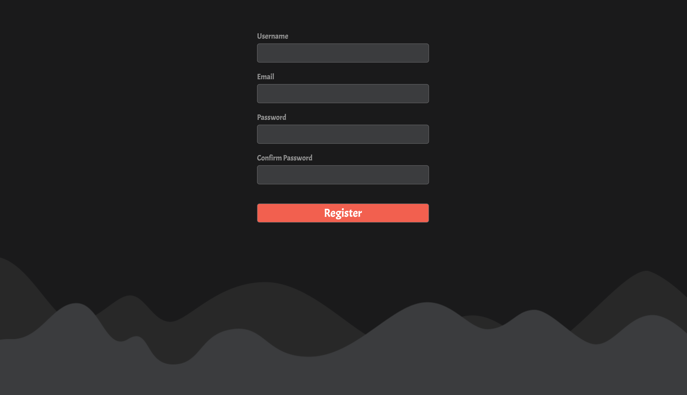
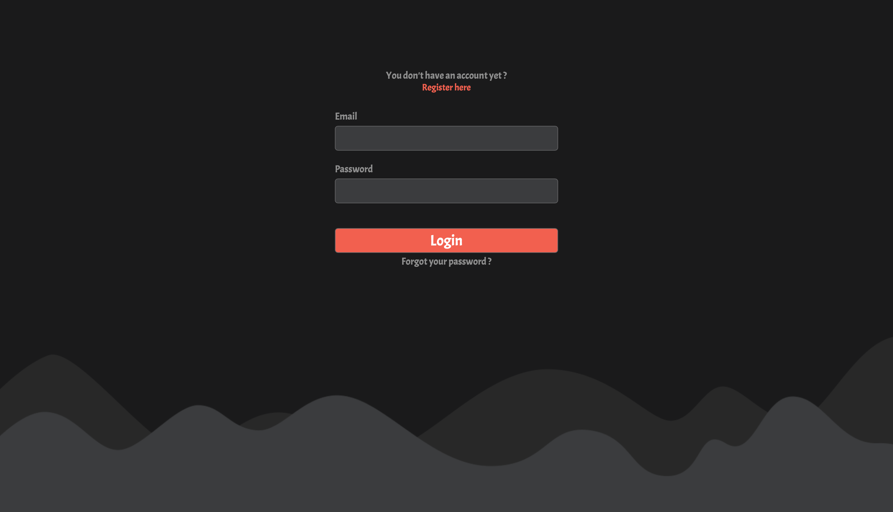
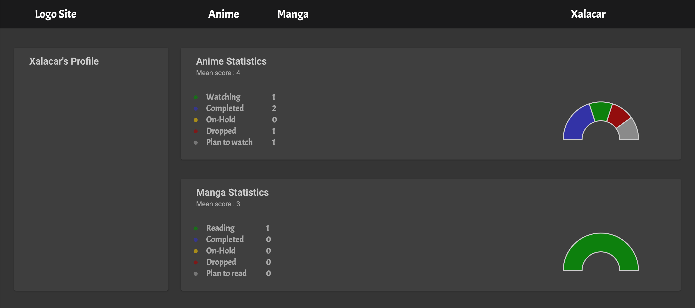
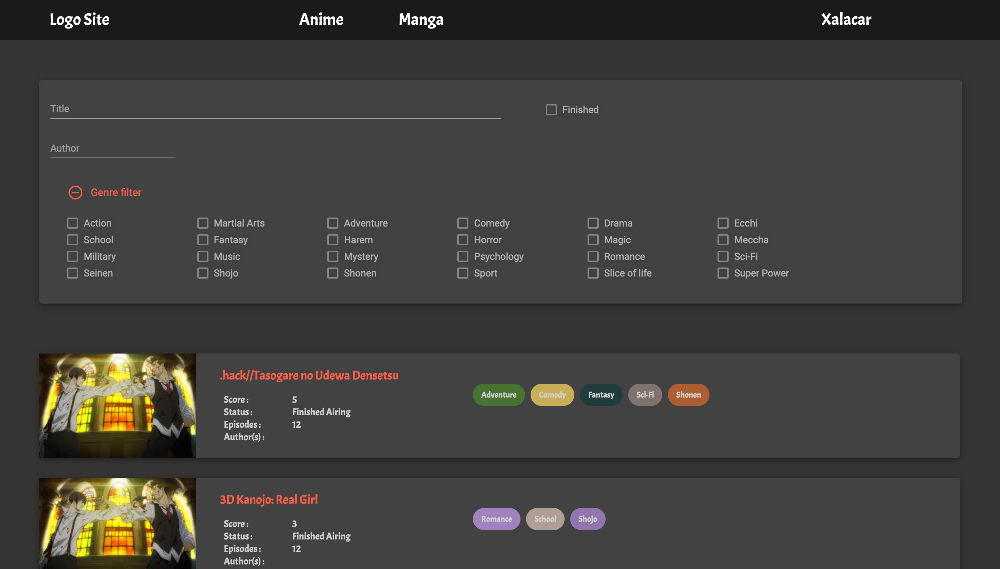
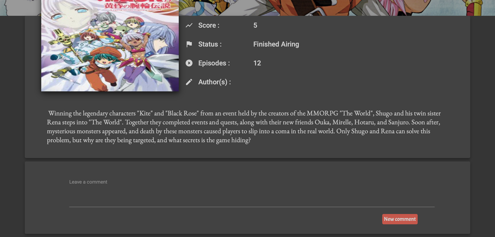

# FrontEnd-MangaProject

Since I am a fan of manga and anime, I always wanted to be able to keep a track of which anime/manga I did watch or read.
So for a long time I used [MyAnimeList](https://myanimelist.net/)'s website . However the general design of the website didn't suit me well, so I decided to try to create mine.
You can also find the API I created for this website on this [repository](https://github.com/verhaghe-benoit/BackEnd-MangaProject).

## Disclaimer

Some features are still in development and the website general appearance might change.
I will still try to keep the screenshot up to date.

## Installing

These instructions will get you a copy of the project up and running on your local machine for development and testing purposes. 

After you cloned this project go into the FrontEnd folder then execute the following command :
```
npm i
```

Once it's done you will be able to start the project with :
```
ng serve
```

Then you can go to :
```
http://localhost:4200/animes
```


## General Design

### Register and Login

Register :


Login : 


### User Profile



### Anime and Manga



### Details of the selected Anime / Manga





